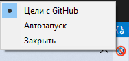
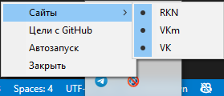

</img>

# AntiBlock
Программа для DDOS-атак на сайты компаний которые блокируют нам доступ в интернет. Программа создана для высказывания своего мнения.
При использовании данной программы с вашего пк, `раз в 1-2 минуты` будут отправляться запросы на сайты которые указаны в данном репозитории, или те которые вы указали в файле конфигурации `targets.json`.

# Возможности
- При запуске вы можете добавить программу в автозагрузку (`работает только на Windows`)

</img>

- В файле конфигурации `targets.json` вы можете указать сайты которые вы хотите подвергнуть атаке (`Данные сайты отобразяться в списке`)
    
</img>

    Также там отображаються сайты которые присутствуют в файле `targets.json` в этом репозитории

- Каждый раз при запуске программы она будет получать свежий список сайтов из репозитория и использовать его, но вы можете выбрать и свой список

- Каждый запрос отправляеться с разными `user-agent` тем самым происходит отправка запросов с `"разных"` устроиств 

- Существует также `cli` версия которая не использует трей, и заточена только под использование локального файла `targets.json`

# #FreeRUnet

Я как разработчик устал от вечных блокировок всего и вся. Поэтому я создал эту программу, чтобы высказать свое мнение. Если вы тоже хотите поучавствовать, то скачивайте и создавайте нагрузку на сеть вместе.
